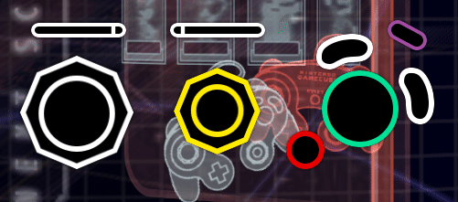

# Master Thesis Subject
Muscle Memory and Embodiment in Video Games

## First Intents:
The subject seems interesting to me as a player who spent a few years in the competitive scene of a specific game but also plays casually with a friend online, talking and executing actions automatically. I'm fascinated by how practicing the repetition of a movement — and how long after stopping practice you can still remember or perform it without thinking. For now, I wouldn't be able to say what I want to deduce as an end result, but I could start interviewing players to get some insights on their routine or how they feel they remember controls in a set video game after some time.

Do players remember movements better when using the same controller or being in the same environment? Another area that could be worth exploring is how this embodied knowledge is impacted by more or less long breaks, injuries, or switching between games. Does playing multiple games at once dilute the precision of muscle memory, or does it strengthen cognitive flexibility?

## Terms & Definitions:

1. **Muscle Memory**: The ability to perform a task without conscious thought, developed through repetition. In gaming, it refers to how players automatically execute certain actions (like combo moves in fighting games or jumps in platformers) without having to consciously think through every step.

2. **Embodied Cognition**: the idea that our thoughts and mental processes are deeply intertwined with and influenced by our physical body and its interactions with the environment.

3. **Flow State**: A mental state of complete immersion and focus in an activity, often characterized by a sense of timelessness and effortless action. In gaming, players enter a flow state when they're fully engaged in the game mechanics, particularly when mastering complex movements.

4. **Automaticity**: The ability to perform actions with little to no conscious thought, developed through repeated practice. In video games, it refers to players ability to perform complex sequences (button combinations in fighting games) without consciously thinking about every input.

5. **Kinesthetic Learning**: Learning through physical activity and movement, emphasizing the importance of doing over passive observation. Video games, especially those requiring precise control (rhythm games), often function as kinesthetic learning environments.

6. **Repetitive Learning**: A process through which skills are honed by repeating actions until they become second nature. Games often use this technique to teach players complex mechanics incrementally.

7. **Motor Learning**: The study of how people acquire and refine movement skills. This concept is relevant to understanding how players learn to control their in-game avatar through physical actions, such as aiming, jumping, or pressing a sequence of buttons.

8. **Peripheral Action**: Refers to actions that are performed on the edge of a player’s awareness. In video games, this is when a player’s movements become so practiced that they’re done almost instinctively or automatically, such as performing a combo without thinking about the specific inputs.

9. **Prehabilitative exercise**: often shortened to "prehab," refers to a proactive approach of optimizing physical and mental health before a surgery or major medical procedure. It's the opposite of rehabilitation, which focuses on recovery after an injury or surgery. Prehabilitation aims to prepare the body for the demands of the procedure and improve outcomes, including faster recovery.

## Relevant Topics:

1. **The Role of Feedback in Muscle Memory**:
   - How game design provides feedback (visual, auditory, tactile) to reinforce muscle memory. For example, the sound effects or vibrations when a player successfully lands a jump or hits a combo.

2. **The Learning Curve in Gaming**:
   - Exploration of how games are designed to gradually increase in difficulty, promoting mastery of physical movements. This ties in with how players develop muscle memory over time.

3. **Cognitive Load vs. Physical Load**:
   - A discussion on how games balance the mental load (strategy, problem-solving, side content) and physical load (button pressing, timing) to facilitate smooth, flowing gameplay.

4. **Physicality in VR and Motion-Control Games**:
   - How immersive technologies (VR, motion controllers) change the relationship between the player and the game, emphasizing more direct physical engagement.

5. **Comparing Video Games to Physical Sports and Music**:
   - Drawing parallels between muscle memory in gaming and how athletes or musicians develop physical skills through practice, focusing on repetition, timing, and body control.

6. **Embodiment and Avatar Movement**:
   - How a player's physical actions translate to avatar actions, creating a sense of embodiment. For example, how the act of moving a character in a game can feel like an extension of oneself.

## Potential research questions:

1. **How do repetition and incremental challenge design support the transition from conscious action to muscle memory in games?**

2. **How does the development of muscle memory in virtual video game environments compare to the acquisition of physical skills in real world activities like sports or music?**

3. **How does the materiality of controllers (gamepads, motion controls, VR setups) change the nature of embodied interaction?**

## Visuals

1. if starting from scratch find a research question worth investigating
2. find a specific enough topic 
3. i did not have enough time to write the rest

## Few notes on the 1 on 1 with teachers

* Not go to much into a scientific subject and think more dsign maybe
* Might have to focus more probbly on the performance aspects of muscle memory in video games, might need to concentrate on the competetive scene of a specific game or genre
* Difine the context (domestic, e-sport...)
* Methodology wise could look for online forums like reddit for dicution based on performance in e-sport and all
* Articles online and videos on youtube/twitch on how to improve skills
* Also compiling tools that I can find online made to improve reflexes and muscle memory