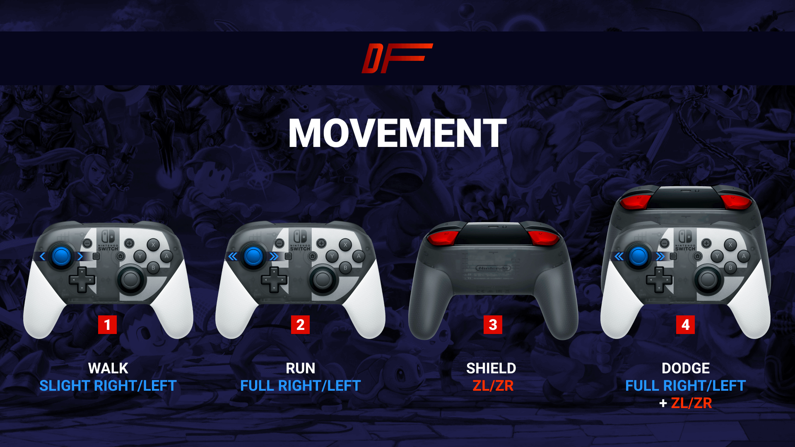
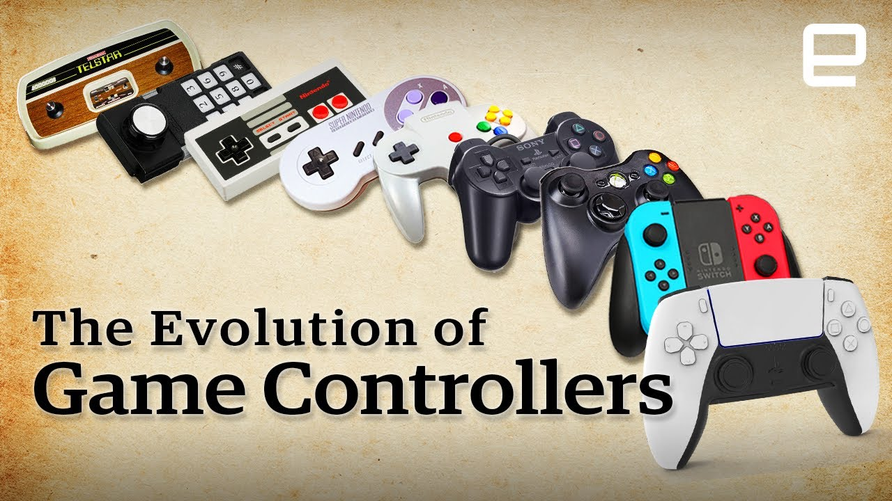

# Master Thesis Subject
Muscle Memory and Embodiment in Video Games

## Terms & Definitions:

1. **Muscle Memory**: The ability to perform a task without conscious thought, developed through repetition. In gaming, it refers to how players automatically execute certain actions (like combo moves in fighting games or jumps in platformers) without having to consciously think through every step.

2. **Embodied Cognition**: the idea that our thoughts and mental processes are deeply intertwined with and influenced by our physical body and its interactions with the environment.

3. **Flow State**: A mental state of complete immersion and focus in an activity, often characterized by a sense of timelessness and effortless action. In gaming, players enter a flow state when they're fully engaged in the game mechanics, particularly when mastering complex movements.

4. **Automaticity**: The ability to perform actions with little to no conscious thought, developed through repeated practice. In video games, it refers to players ability to perform complex sequences (button combinations in fighting games) without consciously thinking about every input.

5. **Kinesthetic Learning**: Learning through physical activity and movement, emphasizing the importance of doing over passive observation. Video games, especially those requiring precise control (rhythm games), often function as kinesthetic learning environments.

6. **Repetitive Learning**: A process through which skills are honed by repeating actions until they become second nature. Games often use this technique to teach players complex mechanics incrementally.

7. **Motor Learning**: The study of how people acquire and refine movement skills. This concept is relevant to understanding how players learn to control their in-game avatar through physical actions, such as aiming, jumping, or pressing a sequence of buttons.

8. **Peripheral Action**: Refers to actions that are performed on the edge of a player’s awareness. In video games, this is when a player’s movements become so practiced that they’re done almost instinctively or automatically, such as performing a combo without thinking about the specific inputs.

## Relevant Topics:

1. **The Role of Feedback in Muscle Memory**:
   - How game design provides feedback (visual, auditory, tactile) to reinforce muscle memory. For example, the sound effects or vibrations when a player successfully lands a jump or hits a combo.

2. **The Learning Curve in Gaming**:
   - Exploration of how games are designed to gradually increase in difficulty, promoting mastery of physical movements. This ties in with how players develop muscle memory over time.

3. **Cognitive Load vs. Physical Load**:
   - A discussion on how games balance the mental load (strategy, problem-solving) and physical load (button pressing, timing) to facilitate smooth, flowing gameplay.

4. **Physicality in VR and Motion-Control Games**:
   - How immersive technologies (VR, motion controllers) change the relationship between the player and the game, emphasizing more direct physical engagement (Beat Saber, Half-Life: Alyx).

5. **Comparing Video Games to Physical Sports and Music**:
   - Drawing parallels between muscle memory in gaming and how athletes or musicians develop physical skills through practice, focusing on repetition, timing, and body control.

6. **Embodiment and Avatar Movement**:
   - How a player's physical actions translate to avatar actions, creating a sense of embodiment. For example, how the act of moving a character in a game can feel like an extension of oneself.

## Potential research questions:

1. **How do repetition and incremental challenge design support the transition from conscious action to muscle memory in games?**

2. **How does the development of muscle memory in virtual video game environments compare to the acquisition of physical skills in real world activities like sports or music?**

3. **How does the materiality of controllers (gamepads, motion controls, VR setups) change the nature of embodied interaction?**

## Academic articles:

## Muscle relaxation enhances motor imagery capacity in people with anxiety: A randomized clinical trial

Trapero-Asenjo, S., Fernández-Guinea, S., Guillot, A., Pecos-Martin, D., & Nunez-Nagy, S. (2025). Muscle relaxation enhances motor imagery capacity in people with anxiety : A randomized clinical trial. PLoS ONE, 20(1), e0316723. https://doi.org/10.1371/journal.pone.0316723

* The study explores how muscle relaxation before motor imagery (MI) improves MI capacity in people with anxiety. Participants who practiced muscle relaxation showed better imagery performance without affecting the timing of movements. This suggests relaxation can boost MI effectiveness in anxious individuals.

## Learning, Attentional Control, and Action Video Games

https://www.cell.com/current-biology/fulltext/S0960-9822(12)00130-3?_returnURL=http://linkinghub.elsevier.com%2Fretrieve%2Fpii%2FS0960982212001303%3Fshowall%3Dtrue&cc=y%3D

* ​The study "Learning, Attentional Control, and Action Video Games" published in Current Biology explores how playing action video games (AVGs) influences cognitive functions. It highlights that AVG players often exhibit enhanced attentional control, faster visual processing, and improved multitasking abilities compared to non-players. These cognitive benefits are attributed to the high demands AVGs place on visual attention and decision-making skills. The research suggests that regular engagement with AVGs can lead to measurable improvements in these cognitive domains.​

## Long-Term Motor Learning in the “Wild” With High Volume Video Game Data

Listman, J. B., Tsay, J. S., Kim, H. E., Mackey, W. E., & Heeger, D. J. (2021). Long-Term Motor Learning in the “Wild” With High Volume Video Game Data. Frontiers In Human Neuroscience, 15. https://doi.org/10.3389/fnhum.2021.777779

* The study analyzes how people learn motor skills over time in real-world settings using video games. It found that while accuracy improved slowly, motor acuity (speed and precision) increased significantly with practice, especially with about 30 minutes to an hour of daily play. The learning rate was influenced by baseline performance and practice amount. The study shows video game data can be useful for understanding long-term motor skill development outside labs.

## Action Video Game Playing Is Reflected In Enhanced Visuomotor Performance and Increased Corticospinal Excitability

Morin-Moncet, O., Therrien-Blanchet, J., Ferland, M. C., Théoret, H., & West, G. L. (2016b). Action Video Game Playing Is Reflected In Enhanced Visuomotor Performance and Increased Corticospinal Excitability. PLoS ONE, 11(12), e0169013. https://doi.org/10.1371/journal.pone.0169013

* The study investigates how playing action video games affects visuomotor performance and corticospinal excitability. Using the Serial Reaction Time Task and Transcranial Magnetic Stimulation, the researchers found that action video game players (actionVGPs) exhibited faster reaction times and increased corticospinal excitability in the primary motor cortex compared to non-video game players (nonVGPs). However, both groups showed similar levels of procedural motor learning. These findings suggest that action video game playing is associated with enhanced visuomotor performance and increased corticospinal plasticity.

## From gaming to reality: effectiveness of skills transfer from competitive sandbox gaming environment to near and far contexts

Zhong, Y., Fryer, L. K., Zheng, S., Shum, A., & Chu, S. K. W. (2025). From gaming to reality : effectiveness of skills transfer from competitive sandbox gaming environment to near and far contexts. International Journal Of Educational Technology In Higher Education, 22(1). https://doi.org/10.1186/s41239-024-00500-2

* The study explores how skills from competitive sandbox games, particularly critical thinking, creativity, collaboration, and communication, transfer to real-world tasks. It found that while gaming enhanced collaboration skills in near tasks, other skills showed no significant differences. Factors like mentorship and practice influenced the success of skill transfer. The study highlights that sandbox games can improve collaboration but may have limited effects on other skills.

## Using mobile technologies to create interwoven learning interactions: An intuitive design and its evaluation

https://www.sciencedirect.com/science/article/abs/pii/S0360131512001637

* ​The article titled "Using mobile technologies to create interwoven learning interactions" explores how mobile technologies can enhance learning by integrating various learning contexts. It introduces the concept of "interwoven learning interactions," which aims to blend formal and informal learning experiences through mobile devices. The study provides a framework to assist educators in designing mobile learning practices that are innovative and contextually relevant. By leveraging mobile technologies, the approach seeks to create seamless learning experiences that connect different learning environments and activities.

## ntuitive Design: Eight steps to an intuitive UX

https://dl.acm.org/doi/abs/10.5555/3265544

* *Intuitive Design: Eight Steps to an Intuitive UX* is a guide for creating user-friendly interfaces.  
It explains how to align designs with users' mental models, using an eight-step process covering research, structure, interaction, and testing, with real-world examples throughout. Throughout the book, real-world examples illustrate how intuitive design principles can be applied across various platforms and industries.

## Space Vacuum
https://www.jstor.org/stable/community.15616843?searchText=Embodiment%20Video%20Games&searchUri=%2Faction%2FdoBasicSearch%3FQuery%3DEmbodiment%2BVideo%2BGames%26image_search_referrer%3Dglobal%26so%3Drel%26searchkey%3D1745778718464%26doi%3D10.2307%252Fcommunity.15616843&ab_segments=0%2Fbasic_image_search%2Fcontrol&refreqid=fastly-default%3Ae28f7ce343e1bba50c6ce5b24e5b8bd7&searchkey=1745778718464

* The JSTOR page on **"Embodiment in Video Games"** explores how physical movements and gestures are integrated into gameplay. It includes research on how player actions are translated into virtual experiences, the role of gesture recognition, and the embodied experience of interacting with games. These studies enhance understanding of how physicality impacts player engagement and game design.

## Human Perception and Digital Information Technologies: Animation, the Body, and Affect

Human Perception and Digital Information Technologies : Animation, the Body, and Affect   9781529226201, 1529226201 - DOKUMEN.PUB. (s. d.). dokumen.pub. https://dokumen.pub/human-perception-and-digital-information-technologies-animation-the-body-and-affect-9781529226201-1529226201.html

* The book argues that contemporary computational media are not just tools but active participants in the construction of human perception. Through mechanisms like data mining, algorithmic recommendation, and emotionally engaging interfaces, digital technologies externalize memory, influence decision-making, and create sensory pleasures. This dynamic forms a new media ecology where human perception becomes a product of human-machine symbiosis. The body plays a crucial role as a techno-biological entity mediating between perception and machine interaction, with affect serving as a key analytical concept to explore the relationship between biological bodily responses and conscious–nonconscious neurodynamic processes.

## The Movement of Memory: Scanning Dance

https://www.jstor.org/stable/1576564?searchText=Muscle%20Memory%20and%20Embodiment%20in%20Video%20Games&searchUri=%2Faction%2FdoBasicSearch%3FQuery%3DMuscle%2BMemory%2Band%2BEmbodiment%2Bin%2BVideo%2BGames%26so%3Drel&ab_segments=0%2Fbasic_search_gsv2%2Fcontrol&refreqid=fastly-default%3Aebeee53e7ab3f099e6383e8c3d2f4ace

* ​The article "The Movement of Memory: Scanning Dance" by Jennifer M. Parker, published in Dance Research Journal (2001), explores how dance and movement are integral to memory and embodiment. Parker examines the ways in which dance serves as a medium for expressing and preserving memory, highlighting the role of the body in encoding and recalling experiences. The piece delves into the concept of 'muscle memory,' illustrating how repetitive movement patterns become ingrained in the body, allowing for fluid and unconscious performance. Parker also discusses the significance of scanning techniques in capturing and analyzing dance, emphasizing the interplay between technology and the corporeal in understanding movement and memory.​

## Visuals

1. if starting from scratch find a research question worth investigating
2. find a specific enough topic 
3. i did not have enough time to write the rest